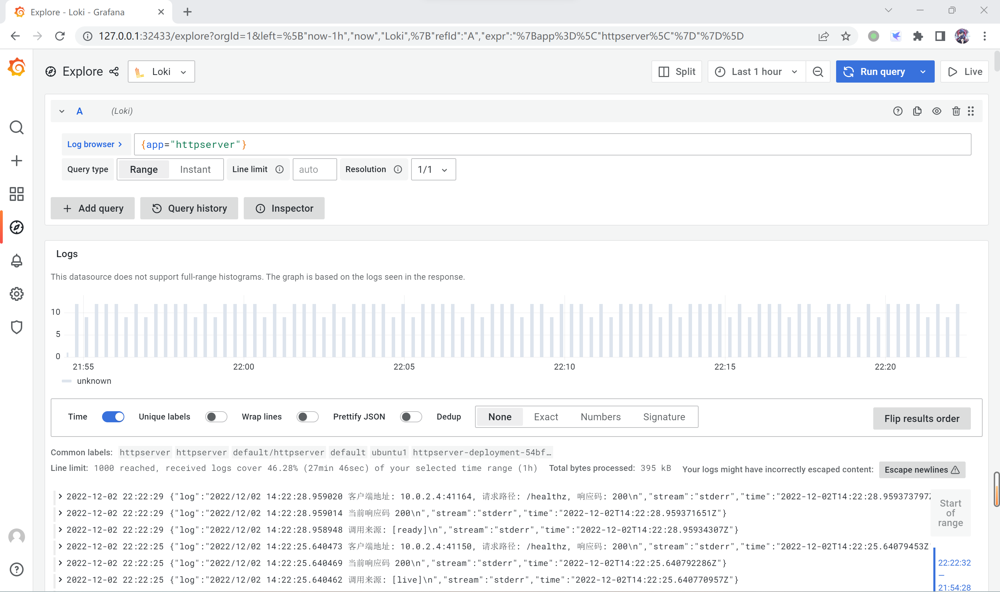
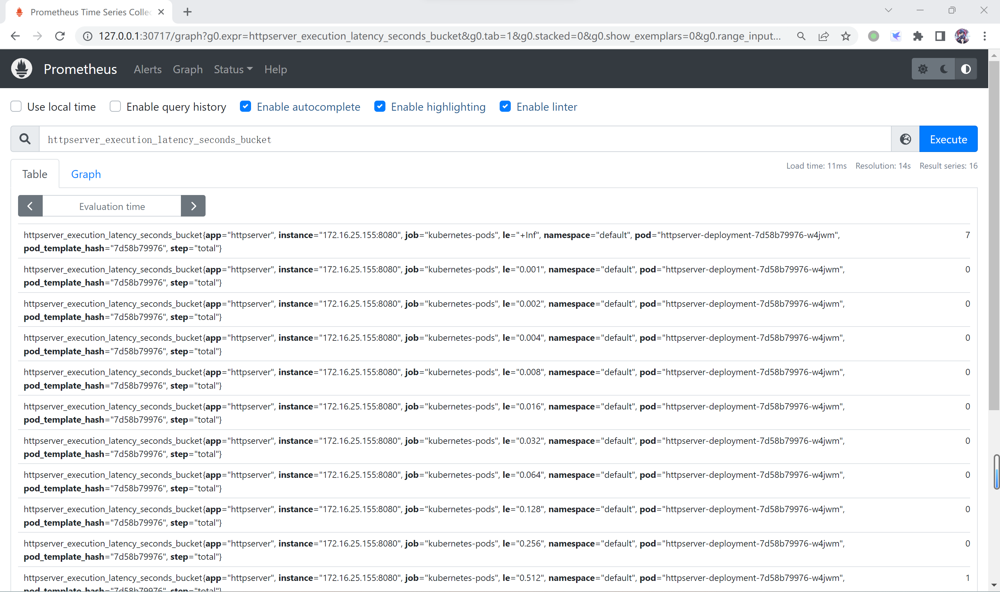
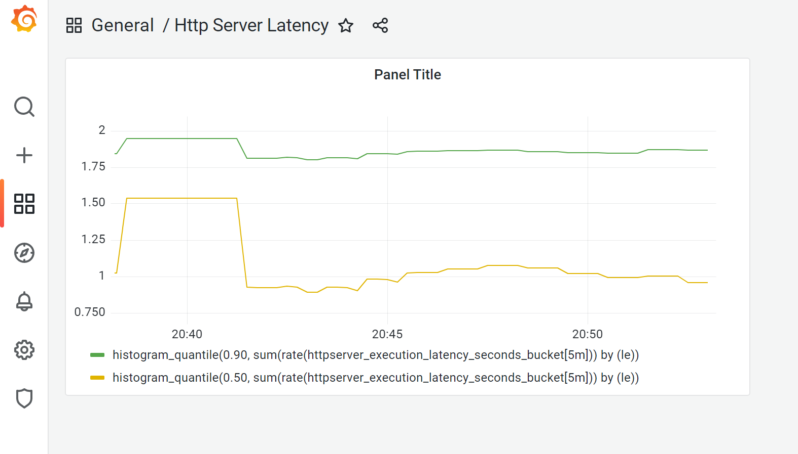

1. 安装helm
   
   ```bash
   root@ubuntu1:~# snap install helm --classic
   helm 3.7.0 from Snapcrafters installed
   ```

2. 安装 loki、prometheus、grafana
   
   ```bash
   root@ubuntu1:~# helm repo add grafana https://grafana.github.io/helm-charts
   "grafana" has been added to your repositorie
   root@ubuntu1:~# helm upgrade --install loki grafana/loki-stack --set grafana.enabled=true,prometheus.enabled=true,prometheus.alertmanager.persistentVolume.enabled=false,prometheus.server.persistentVolume.enabled=false
   Release "loki" does not exist. Installing it now.
   W1202 12:50:55.429346   69841 warnings.go:70] policy/v1beta1 PodSecurityPolicy is deprecated in v1.21+, unavailable in v1.25+
   W1202 12:50:55.594531   69841 warnings.go:70] policy/v1beta1 PodSecurityPolicy is deprecated in v1.21+, unavailable in v1.25+
   W1202 12:50:58.633780   69841 warnings.go:70] policy/v1beta1 PodSecurityPolicy is deprecated in v1.21+, unavailable in v1.25+
   W1202 12:50:58.634047   69841 warnings.go:70] policy/v1beta1 PodSecurityPolicy is deprecated in v1.21+, unavailable in v1.25+
   NAME: loki
   LAST DEPLOYED: Fri Dec  2 12:50:48 2022
   NAMESPACE: default
   STATUS: deployed
   REVISION: 1
   NOTES:
   The Loki stack has been deployed to your cluster. Loki can now be added as a datasource in Grafana.
   
   See http://docs.grafana.org/features/datasources/loki/ for more detail.
   root@ubuntu1:~# kubectl get po
   NAME                                            READY   STATUS    RESTARTS     AGE
   httpserver-deployment-54bfb8f54-cqxth           1/1     Running   2 (5d ago)   5d23h
   loki-0                                          1/1     Running   0            24m
   loki-grafana-7c7b7c7fb4-l4x67                   2/2     Running   0            24m
   loki-kube-state-metrics-5c6b9ddd4f-kwwbb        1/1     Running   0            24m
   loki-prometheus-alertmanager-7d5bdfcb7b-9h5m4   1/2     Running   0            24m
   loki-prometheus-node-exporter-zvtt7             1/1     Running   0            24m
   loki-prometheus-pushgateway-7cdf755958-pntrk    1/1     Running   0            24m
   loki-prometheus-server-6764f67456-rkz4f         2/2     Running   0            24m
   loki-promtail-7bdrb                             1/1     Running   0            24m
   ```

3. 修改 grafana service 类型
   
   ```bash
   root@ubuntu1:~# kubectl edit svc loki-grafana -oyaml
   apiVersion: v1
   kind: Service
   metadata:
     annotations:
       meta.helm.sh/release-name: loki
       meta.helm.sh/release-namespace: default
     creationTimestamp: "2022-12-02T12:51:00Z"
     labels:
       app.kubernetes.io/instance: loki
       app.kubernetes.io/managed-by: Helm
       app.kubernetes.io/name: grafana
       app.kubernetes.io/version: 8.3.5
       helm.sh/chart: grafana-6.43.5
     name: loki-grafana
     namespace: default
     resourceVersion: "250989"
     uid: bd581518-d149-4d98-8396-73e33d75b41c
   spec:
     clusterIP: 10.98.192.87
     clusterIPs:
     - 10.98.192.87
     externalTrafficPolicy: Cluster
     internalTrafficPolicy: Cluster
     ipFamilies:
     - IPv4
     ipFamilyPolicy: SingleStack
     ports:
     - name: service
       nodePort: 32433
       port: 80
       protocol: TCP
       targetPort: 3000
     selector:
       app.kubernetes.io/instance: loki
       app.kubernetes.io/name: grafana
     sessionAffinity: None
     type: NodePort
   status:
     loadBalancer: {}
   root@ubuntu1:~# kubectl get svc
   NAME                            TYPE        CLUSTER-IP       EXTERNAL-IP   PORT(S)        AGE
   kubernetes                      ClusterIP   10.96.0.1        <none>        443/TCP        13d
   loki                            ClusterIP   10.105.241.116   <none>        3100/TCP       47m
   loki-grafana                    NodePort    10.98.192.87     <none>        80:32433/TCP   47m
   loki-headless                   ClusterIP   None             <none>        3100/TCP       47m
   loki-kube-state-metrics         ClusterIP   10.106.230.165   <none>        8080/TCP       47m
   loki-memberlist                 ClusterIP   None             <none>        7946/TCP       47m
   loki-prometheus-alertmanager    ClusterIP   10.111.241.105   <none>        80/TCP         47m
   loki-prometheus-node-exporter   ClusterIP   None             <none>        9100/TCP       47m
   loki-prometheus-pushgateway     ClusterIP   10.111.155.131   <none>        9091/TCP       47m
   loki-prometheus-server          ClusterIP   10.101.169.40    <none>        80/TCP         47m
   ```

4. 查找 grafana 默认密码
   
   ```bash
   root@ubuntu1:~# kubectl get secret loki-grafana -oyaml
   apiVersion: v1
   data:
     admin-password: WGlyQW1UM2FRU1FSTkxSQXJscWJLWkUyR1FabkhrSTFaZjV2bkNSeg==
     admin-user: YWRtaW4=
     ldap-toml: ""
   kind: Secret
   metadata:
     annotations:
       meta.helm.sh/release-name: loki
       meta.helm.sh/release-namespace: default
     creationTimestamp: "2022-12-02T12:50:58Z"
     labels:
       app.kubernetes.io/instance: loki
       app.kubernetes.io/managed-by: Helm
       app.kubernetes.io/name: grafana
       app.kubernetes.io/version: 8.3.5
       helm.sh/chart: grafana-6.43.5
     name: loki-grafana
     namespace: default
     resourceVersion: "244676"
     uid: a2e6944e-42c0-4bdc-adc8-70a8940edff8
   type: Opaque
   root@ubuntu1:~# echo 'WGlyQW1UM2FRU1FSTkxSQXJscWJLWkUyR1FabkhrSTFaZjV2bkNSeg==' | base64 -d
   XirAmT3aQSQRNLRArlqbKZE2GQZnHkI1Zf5vnCRz
   root@ubuntu1:~# echo 'YWRtaW4=' | base64 -d
   admin
   ```

5. 使用 grafana 查看日志
   
   

6. 改造 httpserver 添加指标采集endpoint
   
   增加指标采集
   ```go
   package metrics
   
   import (
   	"fmt"
   	"time"
   
   	"github.com/prometheus/client_golang/prometheus"
   )
   
   const (
   	// 定一个常量，描述指标所属应用
   	MetricsNamespace = "httpserver"
   )
   
   var (
   	// 定义一个采集器
   	functionLatency = CreateExecutionTimeMetric(MetricsNamespace,
   		"Time spent.")
   )
   
   // 创建一个 prometheus 的直方图采集器，用于记录执行时间
   func CreateExecutionTimeMetric(namespace string, help string) *prometheus.HistogramVec {
   	return prometheus.NewHistogramVec(
   		prometheus.HistogramOpts{
   			Namespace: namespace,
   			Name:      "execution_latency_seconds",
   			Help:      help,
   			Buckets:   prometheus.ExponentialBuckets(0.001, 2, 15),
   		}, []string{"step"},
   	)
   }
   
   // 将定义的采集器注册到 prometheus 客户端中
   func Register() {
   	err := prometheus.Register(functionLatency)
   	if err != nil {
   		fmt.Println(err)
   	}
   }
   
   // 定义一个使用prometheus直方图记录执行时间的结构体
   // usual usage pattern is: timer := NewExecutionTimer(...) ; compute ; timer.ObserveStep() ; ... ; timer.ObserveTotal()
   type ExecutionTimer struct {
   	histo *prometheus.HistogramVec
   	start time.Time
   	last  time.Time
   }
   
   // 计算执行时间，并将结果记入直方图中
   func (t *ExecutionTimer) ObserveTotal() {
   	(*t.histo).WithLabelValues("total").Observe(time.Now().Sub(t.start).Seconds())
   }
   
   // 使用传入的直方图创建一个从现在开始计时的新计时器 call ObserveXXX() on it to measure
   func NewExecutionTimer(histo *prometheus.HistogramVec) *ExecutionTimer {
   	now := time.Now()
   	return &ExecutionTimer{
   		histo: histo,
   		start: now,
   		last:  now,
   	}
   }
   
   // 创建一个新计时器，使用上面定义的functionLatency直方图采集器记录指标
   func NewTimer() *ExecutionTimer {
   	return NewExecutionTimer(functionLatency)
   }
   ```

   主函数中注册采集指标，并提供prometheus获取指标的接口。

   ```go
   package main
   
   import (
   	"net/http"

   	"github.com/cloud-native-homework/httpserver/metrics"
   	"github.com/prometheus/client_golang/prometheus/promhttp"
   	log "github.com/sirupsen/logrus"
   )
   
   func main() {
   	// 注册一个 prometheus 指标采集器
   	metrics.Register()
   
   	// 注册业务接口处理函数
   	http.HandleFunc("/", logging(rootHandler))
   	// 增加 prometheus endpoint
   	http.Handle("/metrics", promhttp.Handler())
   
   	// 启动http server
   	err := http.ListenAndServe(":8080", nil)
   	if err != nil {
   		log.Fatal(err)
   	}
   }
   ```

   业务函数中，增加记录指标的函数调用

   ```go
   // 根路径处理函数
   func rootHandler(resp http.ResponseWriter, req *http.Request) {
   	// 创建执行时间计时器
   	timer := metrics.NewTimer()
   	// 函数执行完成，采集器记录执行时间
   	defer timer.ObserveTotal()

   	// 处理业务逻辑
   	// ……
   }
   ```

7. 修改 httpserver deployment 暴露指标采集端口。
   
   ```yaml
   apiVersion: apps/v1
   kind: Deployment
   metadata:
     name: httpserver-deployment
   spec:
     replicas: 1
     selector:
       matchLabels:
         app: httpserver
     template:
       metadata:
         annotations:
           prometheus.io/scrape: "true"
           prometheus.io/port: "8080"
         labels:
           app: httpserver
       spec:
         containers:
           - name: httpserver
             image: httpserver:1.0.6
             ports:
               - containerPort: 8080   
   ```

8. 修改 loki-prometheus-server service type
   ```bash
   root@ubuntu1:/home/hecate/module08-1# kubectl edit svc loki-prometheus-server -oyaml
   apiVersion: v1
   kind: Service
   metadata:
     annotations:
       meta.helm.sh/release-name: loki
       meta.helm.sh/release-namespace: default
     creationTimestamp: "2022-12-02T12:51:00Z"
     labels:
       app: prometheus
       app.kubernetes.io/managed-by: Helm
       chart: prometheus-15.5.4
       component: server
       heritage: Helm
       release: loki
     name: loki-prometheus-server
     namespace: default
     resourceVersion: "269271"
     uid: fa09ce57-7375-43e0-ab81-1e6805983650
   spec:
     clusterIP: 10.101.169.40
     clusterIPs:
     - 10.101.169.40
     externalTrafficPolicy: Cluster
     internalTrafficPolicy: Cluster
     ipFamilies:
     - IPv4
     ipFamilyPolicy: SingleStack
     ports:
     - name: http
       nodePort: 30717
       port: 80
       protocol: TCP
       targetPort: 9090
     selector:
       app: prometheus
       component: server
       release: loki
     sessionAffinity: None
     type: NodePort
   status:
     loadBalancer: {}
   ```
9. 使用 prometheus 查看延时指标
    
10. 循环调用测试接口
    
    ```bash
    while true; do curl 172.16.25.155:8080; done
    ```

11. 使用 grafana dashboard json 创建dashboard，查看指标统计图
    
    