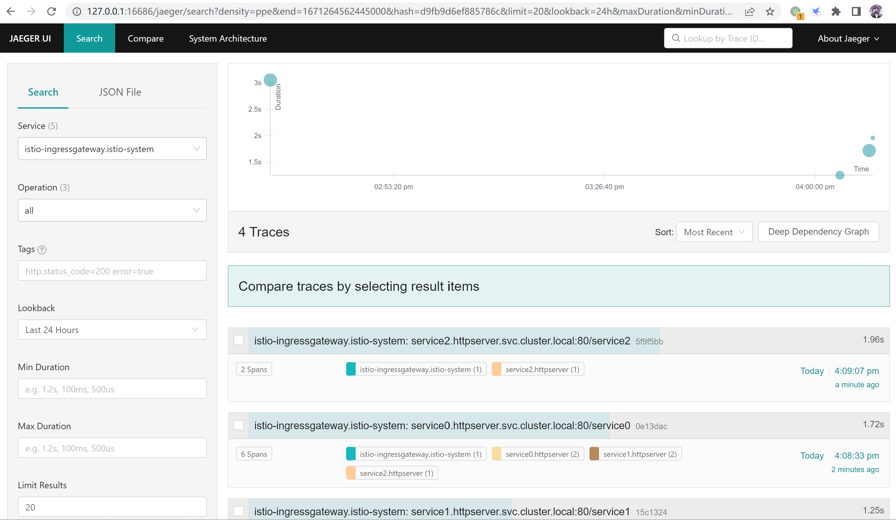

1. 安装 istio
   
   istio安装包需要从GitHub下载，为方便下载，先临时设置curl的代理环境变量
   ```bash
   export http_proxy="http://10.0.2.2:7890"
   export https_proxy="http://10.0.2.2:7890"
   ```

   下载并执行 istio 安装包下载与解压脚本
   ```bash
   hecate@ubuntu1:~$ curl -L https://istio.io/downloadIstio | sh -
     % Total    % Received % Xferd  Average Speed   Time    Time     Time  Current
                                    Dload  Upload   Total   Spent    Left  Speed
   100   101  100   101    0     0    172      0 --:--:-- --:--:-- --:--:--   172
   100  4856  100  4856    0     0   3287      0  0:00:01  0:00:01 --:--:--  7037
   
   Downloading istio-1.16.1 from https://github.com/istio/istio/releases/download/   1.16.1/istio-1.16.1-linux-amd64.tar.gz ...
   
   Istio 1.16.1 Download Complete!
   
   Istio has been successfully downloaded into the istio-1.16.1 folder on your    system.
   
   Next Steps:
   See https://istio.io/latest/docs/setup/install/ to add Istio to your    Kubernetes cluster.
   
   To configure the istioctl client tool for your workstation,
   add the /home/hecate/istio-1.16.1/bin directory to your environment path    variable with:
            export PATH="$PATH:/home/hecate/istio-1.16.1/bin"
   
   Begin the Istio pre-installation check by running:
            istioctl x precheck 
   
   Need more information? Visit https://istio.io/latest/docs/setup/install/
   ```

   下载完成，清除 curl 代理环节变量
   ```bash
   unset http_proxy
   unset https_proxy
   ```

   进入istio目录并把 istioctl 复制到 /usr/bin 目录
   ```bash
   cd istio-1.16.1
   cp bin/istioctl /usr/local/bin
   ```

   安装 istio 到 k8s 集群
   ```bash
   root@ubuntu1:/home/hecate/istio-1.16.1# istioctl install --set profile=demo -y
   ✔ Istio core installed                                                                                                     
   ✔ Istiod installed                                                                                                         
   ✔ Ingress gateways installed                                                                                               
   ✔ Egress gateways installed                                                                                                
   ✔ Installation complete                                                                                                    
   Making this installation the default for injection and validation.
   
   Thank you for installing Istio 1.16.  Please take a few minutes to tell us about your install/upgrade experience!  https://forms.gle/99uiMML96AmsXY5d6   
   ```

   安装完成后，k8s中增加的 istio 的 namespace、pod、service
   ```bash
   root@ubuntu1:/home/hecate/istio-1.16.1# kubectl get ns
   NAME               STATUS   AGE
   calico-apiserver   Active   25d
   calico-system      Active   25d
   default            Active   25d
   istio-system       Active   20m
   kube-node-lease    Active   25d
   kube-public        Active   25d
   kube-system        Active   25d
   tigera-operator    Active   25d
   root@ubuntu1:/home/hecate/istio-1.16.1#  kubectl get po,svc -n istio-system
   NAME                                       READY   STATUS    RESTARTS   AGE
   pod/istio-egressgateway-5c7d99b64c-hr297   1/1     Running   0          15m
   pod/istio-ingressgateway-dd54c8f5c-cn47w   1/1     Running   0          15m
   pod/istiod-664f4476d-dtsvf                 1/1     Running   0          20m
   
   NAME                           TYPE           CLUSTER-IP       EXTERNAL-IP   PORT(S)                                                                      AGE
   service/istio-egressgateway    ClusterIP      10.103.97.136    <none>        80/TCP,443/TCP                                                               15m
   service/istio-ingressgateway   LoadBalancer   10.98.20.109     <pending>     15021:31572/TCP,80:32695/TCP,443:30260/TCP,31400:31472/TCP,15443:32743/TCP   15m
   service/istiod                 ClusterIP      10.111.122.148   <none>        15010/TCP,15012/TCP,443/TCP,15014/TCP                                        20m
   ```

2. 安装 jaeger，设置 tracing 采样比为100%。
   ```sh
   root@ubuntu1:/home/hecate/module12# kubectl apply -f jaeger.yaml
   deployment.apps/jaeger created
   service/tracing created
   service/zipkin created
   service/jaeger-collector created
   root@ubuntu1:/home/hecate/module12# kubectl get pod -n istio-system
   NAME                                   READY   STATUS    RESTARTS       AGE
   istio-egressgateway-5c7d99b64c-hr297   1/1     Running   3 (15h ago)    47h
   istio-ingressgateway-dd54c8f5c-cn47w   1/1     Running   3 (107m ago)   47h
   istiod-664f4476d-dtsvf                 1/1     Running   3 (15h ago)    47h
   jaeger-5d44bc5c5d-nd8jz                1/1     Running   0              46s
   root@ubuntu1:/home/hecate/module12# kubectl edit configmap istio -n istio-system 
   configmap/istio edited
   ```

3. 改造 httpserver，区分service0、service1、service2，service0、1增加调用下游服务与请求头向下游传递逻辑。
   ```go
   // 根路径处理函数
   func rootHandler(resp http.ResponseWriter, req *http.Request) {
   	// 增加一个随机延迟
   	delay := randInt(10, 20)
   	time.Sleep(time.Millisecond * time.Duration(delay))
   	io.WriteString(resp, "===================arrive server0, invoke server1============\n")
   
   	// 创建新请求
   	newReq, err := http.NewRequest("GET", "http://service1/", nil)
   	if err != nil {
   		fmt.Printf("%s", err)
   	}
   	// 创建新请求头
   	lowerCaseHeader := make(http.Header)
   	// 将当前请求中的请求头复制到新请求头中
   	for key, value := range req.Header {
   		lowerCaseHeader[strings.ToLower(key)] = value
   	}
   	log.Info("headers:", lowerCaseHeader)
   	// 为新请求设置请求头
   	newReq.Header = lowerCaseHeader
   	// 创建 http 客户端
   	client := &http.Client{}
   	// 调用 service1
   	newResp, err := client.Do(newReq)
   	if err != nil {
   		log.Info("HTTP get failed with error: ", "error", err)
   	} else {
   		log.Info("HTTP get succeeded")
   	}
   	// 将service1的响应通过当前请求输出
   	if newResp != nil {
   		io.WriteString(resp, "===================server0 print response from server1============\n")
   		newResp.Write(resp)
   	}
   }
   ```

4. 构建 service0、1、2 镜像
   ```sh
   root@ubuntu1:/home/hecate/module12# docker build -f service0/Dockerfile -t service0:1.0.0 service0
   Sending build context to Docker daemon  12.87MB
   Step 1/3 : FROM alpine:3.16
    ---> bfe296a52501
   Step 2/3 : COPY ./service0 /bin/service0
    ---> 8ae5021b83c8
   Step 3/3 : ENTRYPOINT ["/bin/service0"]
    ---> Running in 3565115b38d2
   Removing intermediate container 3565115b38d2
    ---> 60a0343f162a
   Successfully built 60a0343f162a
   Successfully tagged service0:1.0.0
   root@ubuntu1:/home/hecate/module12# docker build -f service1/Dockerfile -t service1:1.0.0 service1
   Sending build context to Docker daemon  12.87MB
   Step 1/3 : FROM alpine:3.16
    ---> bfe296a52501
   Step 2/3 : COPY ./service1 /bin/service1
    ---> bc0c04cef6e9
   Step 3/3 : ENTRYPOINT ["/bin/service1"]
    ---> Running in 453c75715986
   Removing intermediate container 453c75715986
    ---> 7d318e44c2d4
   Successfully built 7d318e44c2d4
   Successfully tagged service1:1.0.0
   root@ubuntu1:/home/hecate/module12# docker build -f service2/Dockerfile -t service2:1.0.0 service2
   Sending build context to Docker daemon  12.33MB
   Step 1/3 : FROM alpine:3.16
    ---> bfe296a52501
   Step 2/3 : COPY ./service2 /bin/service2
    ---> c11bda57804b
   Step 3/3 : ENTRYPOINT ["/bin/service2"]
    ---> Running in c8f0a60f9b98
   Removing intermediate container c8f0a60f9b98
    ---> 2c65d635b229
   Successfully built 2c65d635b229
   Successfully tagged service2:1.0.0
   root@ubuntu1:/home/hecate/module12# docker images
   REPOSITORY                                                        TAG                 IMAGE ID       CREATED              SIZE
   service2                                                          1.0.0               2c65d635b229   9 seconds ago        17.9MB
   service1                                                          1.0.0               7d318e44c2d4   36 seconds ago       18.4MB
   service0                                                          1.0.0               60a0343f162a   About a minute ago   18.4MB
   ```

5. 创建带有istio注入的namespace、service0、1、2 的 deployment、service
   ```sh
   root@ubuntu1:/home/hecate/module12# kubectl apply -f httpserver.yaml 
   namespace/httpserver created
   deployment.apps/service0 created
   service/service0 created
   deployment.apps/service1 created
   service/service1 created
   deployment.apps/service2 created
   service/service2 created
   root@ubuntu1:/home/hecate/module12# kubectl get po,svc -n httpserver
   NAME                            READY   STATUS    RESTARTS   AGE
   pod/service0-5d7b8569d9-9cq76   2/2     Running   0          35s
   pod/service1-c479f75db-6dknp    2/2     Running   0          35s
   pod/service2-59777f446c-zt8n6   2/2     Running   0          35s
   
   NAME               TYPE        CLUSTER-IP       EXTERNAL-IP   PORT(S)   AGE
   service/service0   ClusterIP   10.101.50.86     <none>        80/TCP    35s
   service/service1   ClusterIP   10.98.91.248     <none>        80/TCP    35s
   service/service2   ClusterIP   10.102.134.135   <none>        80/TCP    35s
   ```
   
6. 创建证书
   ```sh
   root@ubuntu1:/home/hecate/module12# openssl req -x509 -sha256 -nodes -days 365 -newkey rsa:2048 -subj '/O=fcx Inc./CN=*.fcx.org' -keyout fcx.org.key -out fcx.org.crt
   Generating a RSA private key
   ...+++++
   ...............................................................................................+++++
   writing new private key to 'fcx.org.key'
   -----
   root@ubuntu1:/home/hecate/module12# ls
   fcx.org.crt  fcx.org.key
   ```

7. 在 istio 中配置证书 secret
   ```sh
   root@ubuntu1:/home/hecate/module12# kubectl create -n istio-system secret tls fcx-crt --key=fcx.org.key --cert=fcx.org.crt
   secret/fcx-crt created
   root@ubuntu1:/home/hecate/module12# kubectl get -n istio-system secret 
   NAME                                               TYPE                                  DATA   AGE
   default-token-7qpcp                                kubernetes.io/service-account-token   3      46h
   fcx-crt                                            kubernetes.io/tls                     2      24s
   istio-ca-secret                                    istio.io/ca-root                      5      46h
   istio-egressgateway-service-account-token-sqmjn    kubernetes.io/service-account-token   3      46h
   istio-ingressgateway-service-account-token-bs2nz   kubernetes.io/service-account-token   3      46h
   istio-reader-service-account-token-nkm7v           kubernetes.io/service-account-token   3      46h
   istiod-service-account-token-s4x8b                 kubernetes.io/service-account-token   3      46h
   istiod-token-n6qqd                                 kubernetes.io/service-account-token   3      46h
   ```

8. 配置 istio VirtualService 和 Gateway
   ```
   root@ubuntu1:/home/hecate/module12# kubectl apply -f istio-vs-gw.yaml -n httpserver
   virtualservice.networking.istio.io/service created
   gateway.networking.istio.io/service created
   ```
   
9. 通过 istio Gateway 访问 httpserver
   ```sh
   root@ubuntu1:/home/hecate/module12# kubectl get svc -nistio-system
   NAME                   TYPE           CLUSTER-IP       EXTERNAL-IP   PORT(S)                                                                      AGE
   istio-egressgateway    ClusterIP      10.103.97.136    <none>        80/TCP,443/TCP                                                               2d
   istio-ingressgateway   LoadBalancer   10.98.20.109     <pending>     15021:31572/TCP,80:32695/TCP,443:30260/TCP,31400:31472/TCP,15443:32743/TCP   2d
   istiod                 ClusterIP      10.111.122.148   <none>        15010/TCP,15012/TCP,443/TCP,15014/TCP                                        2d
   jaeger-collector       ClusterIP      10.104.61.213    <none>        14268/TCP,14250/TCP,9411/TCP                                                 68m
   tracing                ClusterIP      10.109.201.221   <none>        80/TCP,16685/TCP                                                             68m
   zipkin                 ClusterIP      10.101.208.97    <none>        9411/TCP
   root@ubuntu1:/home/hecate/module12# curl --resolve service.fcx.org:443:10.98.20.109 https://service.fcx.org/service0 -v -k
   * Added service.fcx.org:443:10.98.20.109 to DNS cache
   * Hostname service.fcx.org was found in DNS cache
   *   Trying 10.98.20.109:443...
   * TCP_NODELAY set
   * Connected to service.fcx.org (10.98.20.109) port 443 (#0)
   * ALPN, offering h2
   * ALPN, offering http/1.1
   * successfully set certificate verify locations:
   *   CAfile: /etc/ssl/certs/ca-certificates.crt
     CApath: /etc/ssl/certs
   * TLSv1.3 (OUT), TLS handshake, Client hello (1):
   * TLSv1.3 (IN), TLS handshake, Server hello (2):
   * TLSv1.3 (IN), TLS handshake, Encrypted Extensions (8):
   * TLSv1.3 (IN), TLS handshake, Certificate (11):
   * TLSv1.3 (IN), TLS handshake, CERT verify (15):
   * TLSv1.3 (IN), TLS handshake, Finished (20):
   * TLSv1.3 (OUT), TLS change cipher, Change cipher spec (1):
   * TLSv1.3 (OUT), TLS handshake, Finished (20):
   * SSL connection using TLSv1.3 / TLS_AES_256_GCM_SHA384
   * ALPN, server accepted to use h2
   * Server certificate:
   *  subject: O=fcx Inc.; CN=*.fcx.org
   *  start date: Dec 17 04:22:23 2022 GMT
   *  expire date: Dec 17 04:22:23 2023 GMT
   *  issuer: O=fcx Inc.; CN=*.fcx.org
   *  SSL certificate verify result: self signed certificate (18), continuing anyway.
   * Using HTTP2, server supports multi-use
   * Connection state changed (HTTP/2 confirmed)
   * Copying HTTP/2 data in stream buffer to connection buffer after upgrade: len=0
   * Using Stream ID: 1 (easy handle 0x562cfd8f62f0)
   > GET /service0 HTTP/2
   > Host: service.fcx.org
   > user-agent: curl/7.68.0
   > accept: */*
   > 
   * TLSv1.3 (IN), TLS handshake, Newsession Ticket (4):
   * TLSv1.3 (IN), TLS handshake, Newsession Ticket (4):
   * old SSL session ID is stale, removing
   * Connection state changed (MAX_CONCURRENT_STREAMS == 2147483647)!
   < HTTP/2 200 
   < date: Sat, 17 Dec 2022 06:33:49 GMT
   < content-length: 1323
   < content-type: text/plain; charset=utf-8
   < x-envoy-upstream-service-time: 3054
   < server: istio-envoy
   < 
   ===================arrive server0, invoke server1============
   ===================server0 print response from server1============
   HTTP/1.1 200 OK
   Content-Length: 1023
   Content-Type: text/plain; charset=utf-8
   Date: Sat, 17 Dec 2022 06:33:49 GMT
   Server: envoy
   X-Envoy-Upstream-Service-Time: 2898
   
   ===================arrive server1, invoke server2============
   ===================server1 print response from server2============
   HTTP/1.1 200 OK
   Content-Length: 724
   Content-Type: text/plain; charset=utf-8
   Date: Sat, 17 Dec 2022 06:33:49 GMT
   Server: envoy
   X-Envoy-Upstream-Service-Time: 2814
   
   hello world
   ===================service2 Details of the http request header:============
   X-B3-Traceid=[fd749435e7bb8f36a533f618f6d39520]
   X-Forwarded-For=[10.0.2.4]
   X-Envoy-Internal=[true]
   X-Request-Id=[8937590f-1518-920e-9ef2-a41a17db3c42]
   X-B3-Spanid=[857466eeb0d14633]
   User-Agent=[Go-http-client/1.1,Go-http-client/1.1,curl/7.68.0]
   Accept-Encoding=[gzip,gzip]
   X-Envoy-Original-Path=[/service0]
   X-Forwarded-Proto=[https]
   X-Forwarded-Client-Cert=[By=spiffe://cluster.local/ns/httpserver/sa/default;Hash=edd910c105d7596cded151756e79673db71758b4c7762a06e29d491d0563e438;Subject="";URI=spiffe://cluster.local/ns/httpserver/sa/default]
   X-B3-Parentspanid=[8503c45df53fa426]
   X-Envoy-Attempt-Count=[1]
   Accept=[*/*]
   X-B3-Sampled=[1]
   * Connection #0 to host service.fcx.org left intact
   ```

10. 从 jaeger dashboard 查看链路跟踪信息
    `--address` 指定dashboard访问ip到虚拟机ip上，方便通宿主机访问
    ```sh
    root@ubuntu1:/home/hecate/module12# istioctl dashboard jaeger --address 10.0.2.4
    http://10.0.2.4:16686
    Failed to open browser; open http://10.0.2.4:16686 in your browser.
    
    ```
    访问jaeger控制面板查看链路跟踪信息
    